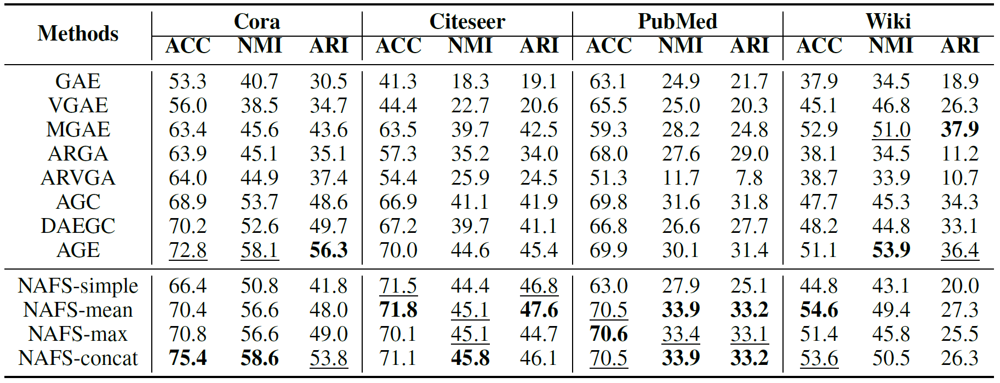
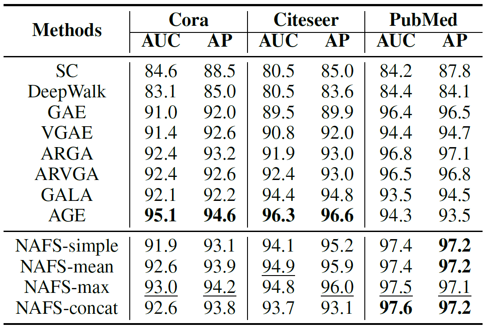

## NAFS: A Simple Yet Tough-to-beat Baseline for Graph Representation Learning

### Requirements

Environments: Xeon Gold 5120 (CPU), 384GB(RAM), TITAN RTX (GPU), Ubuntu 16.04 (OS).

The PyTorch version we use is torch 1.7.1+cu110. Please refer to the official website -- https://pytorch.org/get-started/locally/ -- for the detailed installation instructions.

To install all the requirements:

```setup
pip install -r requirements.txt
```


### NAFS Evaluation

To reproduce the results of NAFS on the node clustering task and the link prediction task, please run the following command:

```train
cd ./src; bash ./run.sh
```

 

### Node Clustering Results:



### Link Prediction Results:


